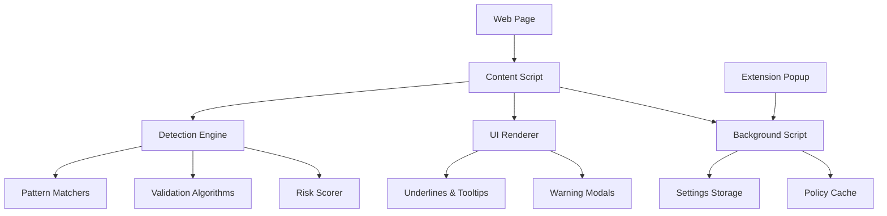

# Design Document

## Overview

LeakAI is implemented as a Chrome extension using Manifest V3 architecture. The extension consists of a content script that monitors text inputs across all web pages, a background service worker for coordination, and a popup interface for user controls. The core detection engine runs entirely in the browser using deterministic patterns, validation algorithms, entropy analysis, and optionally a lightweight NER model via Transformers.js for enhanced name/location detection.

## Architecture

### High-Level Architecture



### Component Interaction Flow

1. **Content Script** monitors all text input events on web pages
2. **Detection Engine** processes text through multiple detection layers
3. **UI Renderer** applies visual indicators and interactive elements
4. **Background Script** manages settings, policies, and cross-tab coordination
5. **Extension Popup** provides user controls and configuration

## Components and Interfaces

### Content Script (`content.js`)

**Responsibilities:**
- Monitor text input events across all form fields
- Coordinate with detection engine for real-time analysis
- Render visual indicators (underlines, tooltips)
- Handle user interactions with detected items
- Intercept form submissions for pre-submission checks

**Key Methods:**
```javascript
class ContentScript {
  initialize()                    // Set up event listeners and observers
  onTextInput(event)             // Handle text input events
  scanTextContent(text, element) // Trigger detection analysis
  renderDetections(detections)   // Apply visual indicators
  showTooltip(detection, element) // Display hover tooltips
  interceptFormSubmission(form)  // Pre-submission validation
}
```

### Detection Engine (`detection-engine.js`)

**Responsibilities:**
- Coordinate multiple detection strategies (deterministic + optional ML)
- Apply confidence scoring and risk assessment
- Cache detection results for performance
- Manage detection categories and rules
- Handle optional NER model loading and inference

**Key Methods:**
```javascript
class DetectionEngine {
  constructor() {
    this.nerModel = null;        // Optional lightweight NER model
  }
  
  async initialize()             // Load optional models
  detectSensitiveData(text)      // Main detection orchestrator
  scoreConfidence(matches)       // Calculate confidence levels
  categorizeRisk(detections)     // Assign risk levels
  cacheResults(text, results)    // Performance optimization
  isModelAvailable()             // Check if NER model is loaded
}
```

### Pattern Matchers (`patterns/`)

**Email Detector (`patterns/email.js`):**
```javascript
class EmailDetector {
  detect(text)                   // Regex-based email detection
  validate(email)                // Additional validation checks
  extractContext(text, match)    // Surrounding context analysis
}
```

**Phone Detector (`patterns/phone.js`):**
```javascript
class PhoneDetector {
  detect(text)                   // E.164 and common format detection
  validateFormat(phone)          // Format validation
  normalizeNumber(phone)         // Standardize format
}
```

**Credit Card Detector (`patterns/credit-card.js`):**
```javascript
class CreditCardDetector {
  detect(text)                   // 13-19 digit pattern matching
  luhnValidation(number)         // Luhn algorithm validation
  identifyCardType(number)       // Visa, MC, Amex, etc.
}
```

**API Key Detector (`patterns/api-keys.js`):**
```javascript
class ApiKeyDetector {
  detect(text)                   // Known prefix patterns
  entropyAnalysis(string)        // High-entropy string detection
  validateKeyFormat(key, type)   // Format-specific validation
}
```

**Name/Location Detector (`patterns/ner.js`):**
```javascript
class NERDetector {
  constructor() {
    this.pipeline = null;        // Transformers.js NER pipeline
  }
  
  async loadModel()              // Load Transformers.js NER model
  detectNames(text)              // Person name detection
  detectLocations(text)          // Location/address detection
  detectOrganizations(text)      // Company/org name detection
  fallbackToHeuristics(text)     // Regex-based fallback
}
```

**Crypto Detector (`patterns/crypto.js`):**
```javascript
class CryptoDetector {
  detectSeedPhrase(text)         // BIP-39 word list matching
  detectPrivateKey(text)         // Private key format detection
  detectWalletAddress(text)      // Cryptocurrency address patterns
}
```

### UI Renderer (`ui-renderer.js`)

**Responsibilities:**
- Apply category-specific underlines to detected text
- Create and manage tooltip overlays
- Handle user interactions with visual elements
- Render warning modals and action buttons

**Key Methods:**
```javascript
class UIRenderer {
  underlineText(element, detections)     // Apply colored underlines
  createTooltip(detection)               // Generate tooltip content
  showActionMenu(detection, element)     // Display action options
  renderWarningModal(detections)         // Pre-submission warnings
}
```

### Background Script (`background.js`)

**Responsibilities:**
- Manage extension settings and user preferences
- Handle cross-tab communication and coordination
- Cache policies and detection rules
- Coordinate with popup interface

**Key Methods:**
```javascript
class BackgroundScript {
  initializeSettings()           // Load user preferences
  updatePolicyCache()            // Refresh detection rules
  handleMessage(message, sender) // Inter-component communication
  syncSettings()                 // Cross-tab settings sync
}
```

### Extension Popup (`popup/`)

**Responsibilities:**
- Provide user interface for extension controls
- Display detection statistics and recent activity
- Allow configuration of detection categories
- Offer quick enable/disable toggles

**Components:**
- `popup.html` - Main popup interface
- `popup.js` - Popup logic and event handling
- `popup.css` - Styling and layout

## Data Models

### Detection Result

```javascript
interface DetectionResult {
  id: string;                    // Unique detection identifier
  type: DetectionType;           // Category of sensitive data
  text: string;                  // Detected text content
  startIndex: number;            // Start position in original text
  endIndex: number;              // End position in original text
  confidence: number;            // Confidence score (0-1)
  riskLevel: RiskLevel;          // LOW, MEDIUM, HIGH
  context: string;               // Surrounding text context
  suggestions: Action[];         // Available remediation actions
  metadata: object;              // Type-specific additional data
}
```

### Detection Types

```javascript
enum DetectionType {
  EMAIL = 'email',
  PHONE = 'phone',
  CREDIT_CARD = 'credit_card',
  API_KEY = 'api_key',
  CRYPTO_SEED = 'crypto_seed',
  CRYPTO_PRIVATE_KEY = 'crypto_private_key',
  CRYPTO_ADDRESS = 'crypto_address',
  HEALTH_INFO = 'health_info',
  COMPANY_CONFIDENTIAL = 'company_confidential'
}
```

### Risk Levels and Actions

```javascript
enum RiskLevel {
  LOW = 'low',        // Gray underline, informational only
  MEDIUM = 'medium',  // Amber underline, warning on submit
  HIGH = 'high'       // Red underline, block on submit
}

enum Action {
  MASK = 'mask',           // Replace with masked version
  REMOVE = 'remove',       // Delete the text
  REPLACE = 'replace',     // Allow user to enter replacement
  ENCRYPT = 'encrypt',     // Replace with encrypted token
  IGNORE_ONCE = 'ignore_once' // Temporarily ignore this instance
}
```

### Settings Schema

```javascript
interface ExtensionSettings {
  enabled: boolean;                    // Master enable/disable
  detectionCategories: {               // Per-category toggles
    [DetectionType]: boolean;
  };
  riskThresholds: {                    // Confidence thresholds
    low: number;
    medium: number;
    high: number;
  };
  uiPreferences: {
    showTooltips: boolean;
    quietMode: boolean;
    colorScheme: ColorScheme;
  };
  modelSettings: {                     // ML model preferences
    enableNER: boolean;                // Enable lightweight NER model
    modelSize: 'tiny' | 'small';       // Model size preference
    autoDownload: boolean;             // Auto-download models
  };
  domainOverrides: {                   // Per-domain settings
    [domain: string]: DomainSettings;
  };
}
```

## Error Handling

### Detection Engine Errors

- **Pattern Compilation Errors:** Gracefully handle regex compilation failures with fallback patterns
- **Performance Timeouts:** Implement timeouts for detection operations to prevent UI blocking
- **Memory Limits:** Monitor memory usage and implement cleanup for large text processing

### UI Rendering Errors

- **DOM Manipulation Failures:** Handle cases where target elements are modified by other scripts
- **CSS Injection Conflicts:** Use unique class names and CSS isolation techniques
- **Event Handler Conflicts:** Implement proper event delegation and cleanup

### Storage and Settings Errors

- **Chrome Storage API Failures:** Implement fallback to localStorage with error recovery
- **Settings Corruption:** Validate settings on load with automatic reset to defaults
- **Cross-Tab Synchronization Issues:** Handle race conditions in settings updates

### Error Recovery Strategies

```javascript
class ErrorHandler {
  handleDetectionError(error, context) {
    // Log error, disable problematic detector, continue with others
  }
  
  handleUIError(error, element) {
    // Remove problematic UI elements, maintain core functionality
  }
  
  handleStorageError(error, operation) {
    // Fallback to memory storage, notify user of persistence issues
  }
}
```

## Testing Strategy

### Unit Testing

**Detection Engine Tests:**
- Test each pattern matcher with known positive and negative cases
- Validate Luhn algorithm implementation with test credit card numbers
- Test entropy analysis with various string types
- Verify confidence scoring algorithms

**UI Component Tests:**
- Test underline rendering with various text selections
- Validate tooltip positioning and content
- Test action button functionality
- Verify modal dialog behavior

### Integration Testing

**Content Script Integration:**
- Test detection across different website layouts
- Verify compatibility with popular web frameworks (React, Angular, Vue)
- Test form submission interception
- Validate cross-frame communication

**Extension API Integration:**
- Test Chrome storage API usage
- Verify message passing between components
- Test popup-background script communication
- Validate permissions and security boundaries

### Performance Testing

**Detection Performance:**
- Benchmark detection speed with various text lengths
- Test memory usage with large documents
- Validate real-time performance during typing
- Measure impact on page load times

**UI Performance:**
- Test rendering performance with many detections
- Validate smooth scrolling with underlined text
- Measure tooltip display latency
- Test modal rendering performance

### Security Testing

**Data Privacy:**
- Verify no data leaves the browser
- Test isolation between different websites
- Validate secure storage of user settings
- Confirm no sensitive data in logs

**Injection Protection:**
- Test against XSS attempts through detected text
- Validate CSS injection protection
- Test DOM manipulation security
- Verify content script isolation

### Browser Compatibility Testing

- Test across Chrome versions (latest 3 major versions)
- Validate Manifest V3 compliance
- Test on different operating systems
- Verify mobile Chrome compatibility (basic functionality)

### User Acceptance Testing

**Usability Testing:**
- Test detection accuracy with real-world examples
- Validate tooltip clarity and usefulness
- Test action button effectiveness
- Measure user workflow disruption

**Accessibility Testing:**
- Test screen reader compatibility
- Validate keyboard navigation
- Test high contrast mode support
- Verify color blind accessibility