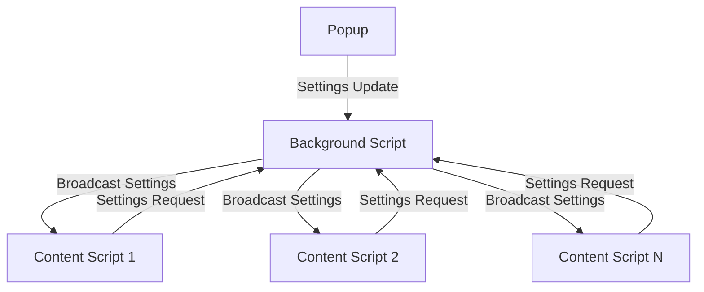

# LeakAI Chrome Extension - Developer Guide

## Architecture Overview

LeakAI is built as a Chrome Manifest V3 extension with a modular architecture designed for maintainability, performance, and extensibility.

### Core Components

```
LeakAI Extension
├── Manifest V3 Configuration
├── Background Service Worker
├── Content Scripts
├── Popup Interface
├── Detection Engine
├── Pattern Matchers
├── UI Renderer
├── Action Menu System
└── Settings Management
```

## Project Structure

```
leakai-extension/
├── manifest.json              # Extension manifest
├── background/
│   └── background.js          # Service worker
├── content/
│   ├── content.js            # Main content script
│   ├── content.css           # Styling for detection UI
│   └── tooltip.html          # Tooltip template
├── popup/
│   ├── popup.html            # Extension popup
│   ├── popup.js              # Popup controller
│   └── popup.css             # Popup styling
├── patterns/
│   ├── data-models.js        # Data structures and types
│   ├── detection-engine.js   # Core detection orchestrator
│   ├── email-detector.js     # Email pattern matcher
│   ├── phone-detector.js     # Phone pattern matcher
│   ├── credit-card-detector.js # Credit card validator
│   ├── api-key-detector.js   # API key detector
│   ├── crypto-detector.js    # Cryptocurrency detector
│   ├── health-detector.js    # Health information detector
│   ├── company-confidential-detector.js # Org-specific detector
│   ├── ner-detector.js       # Named entity recognition
│   ├── error-handler.js      # Error handling utilities
│   └── performance-monitor.js # Performance tracking
├── tests/                    # Test suites
├── scripts/                  # Build and packaging scripts
└── docs/                     # Documentation
```

## Core Architecture

### 1. Content Script (`content/content.js`)

The main content script is the heart of the extension, responsible for:

- **Text Input Monitoring**: Listens for input events across all form fields
- **Detection Coordination**: Triggers detection engine for text analysis
- **UI Rendering**: Applies visual indicators and manages tooltips
- **User Interaction**: Handles clicks, hovers, and action menu operations
- **Settings Management**: Responds to configuration changes
- **Form Interception**: Blocks risky form submissions

```javascript
class ContentScript {
    constructor() {
        this.detectionEngine = new DetectionEngine();
        this.uiRenderer = new UIRenderer();
        this.actionMenu = new ActionMenu();
        this.settings = null;
        this.extensionEnabled = true;
    }

    async initialize() {
        await this.loadSettings();
        await this.detectionEngine.initialize();
        this.setupEventListeners();
        this.setupMessageHandlers();
    }
}
```

### 2. Detection Engine (`patterns/detection-engine.js`)

Orchestrates all detection strategies and manages the detection pipeline:

- **Pattern Coordination**: Manages multiple detector instances
- **Settings Integration**: Filters detections based on user preferences
- **Caching**: Optimizes performance with result caching
- **Error Handling**: Gracefully handles detector failures
- **NER Integration**: Optional machine learning enhancement

```javascript
class DetectionEngine {
    async detectSensitiveData(text, options = {}) {
        const detections = [];
        const enabledCategories = options.enabledCategories || {};

        // Run pattern detectors
        for (const [name, detector] of this.detectors) {
            if (this._isDetectorEnabled(name, enabledCategories)) {
                const results = detector.detect(text);
                detections.push(...results);
            }
        }

        // Run NER detector if available
        if (this.nerDetector && options.enableNER !== false) {
            const nerResults = await this.nerDetector.detect(text);
            detections.push(...nerResults);
        }

        return this._removeDuplicateDetections(detections);
    }
}
```

### 3. Pattern Detectors

Each detector implements a consistent interface:

```javascript
class EmailDetector {
    detect(text) {
        const detections = [];
        const emailRegex = /\b[A-Za-z0-9._%+-]+@[A-Za-z0-9.-]+\.[A-Z|a-z]{2,}\b/g;
        
        let match;
        while ((match = emailRegex.exec(text)) !== null) {
            detections.push(createDetectionResult({
                type: DetectionType.EMAIL,
                text: match[0],
                startIndex: match.index,
                endIndex: match.index + match[0].length,
                confidence: this._calculateConfidence(match[0]),
                riskLevel: this._assessRisk(match[0], text),
                context: this._extractContext(text, match.index),
                suggestions: [Action.MASK, Action.REMOVE, Action.REPLACE]
            }));
        }
        
        return detections;
    }
}
```

### 4. Background Service Worker (`background/background.js`)

Manages extension lifecycle and cross-tab coordination:

- **Settings Storage**: Persists user preferences using Chrome storage API
- **Message Handling**: Facilitates communication between components
- **Cross-Tab Sync**: Ensures settings changes propagate to all tabs
- **Extension Lifecycle**: Handles installation, updates, and startup

```javascript
class BackgroundScript {
    async handleMessage(message, sender, sendResponse) {
        const { type, data } = message;
        
        switch (type) {
            case 'GET_SETTINGS':
                return await this.getSettings();
            case 'UPDATE_SETTINGS':
                return await this.updateSettings(data);
            case 'SYNC_REQUEST':
                return await this.syncSettingsToAllTabs();
        }
    }
}
```

### 5. UI Renderer (`content/content.js` - UIRenderer class)

Handles all visual aspects of detection:

- **Visual Indicators**: Applies category-specific colored underlines
- **Tooltip Management**: Shows/hides informational tooltips
- **DOM Manipulation**: Safely modifies page elements
- **Event Handling**: Manages hover and click interactions

```javascript
class UIRenderer {
    renderDetections(element, detections) {
        // Apply visual indicators without modifying input content
        element.classList.add('leakai-has-detections');
        
        const highestRisk = this._getHighestRiskLevel(detections);
        element.classList.add(`leakai-risk-${highestRisk}`);
        
        const primaryCategory = this._getPrimaryCategory(detections);
        element.classList.add(`leakai-category-${primaryCategory}`);
        
        // Store detection data for tooltip access
        element.setAttribute('data-leakai-detections', JSON.stringify(detections));
        
        this._addElementEventListeners(element, detections);
    }
}
```

## Data Models

### Detection Result Structure

```javascript
interface DetectionResult {
    id: string;                    // Unique identifier
    type: DetectionType;           // Category of sensitive data
    text: string;                  // Detected text content
    startIndex: number;            // Start position in text
    endIndex: number;              // End position in text
    confidence: number;            // Confidence score (0-1)
    riskLevel: RiskLevel;          // LOW, MEDIUM, HIGH
    context: string;               // Surrounding text context
    suggestions: Action[];         // Available remediation actions
    metadata: object;              // Type-specific additional data
}
```

### Settings Schema

```javascript
interface ExtensionSettings {
    enabled: boolean;                    // Master enable/disable
    detectionCategories: {               // Per-category toggles
        email: boolean;
        phone: boolean;
        credit_card: boolean;
        api_key: boolean;
        crypto_seed: boolean;
        crypto_private_key: boolean;
        crypto_address: boolean;
        health_info: boolean;
        company_confidential: boolean;
        person_name: boolean;
        location: boolean;
        organization: boolean;
    };
    riskThresholds: {                    // Confidence thresholds
        low: number;
        medium: number;
        high: number;
    };
    uiPreferences: {
        showTooltips: boolean;
        quietMode: boolean;
        colorScheme: string;
    };
    modelSettings: {                     // ML model preferences
        enableNER: boolean;
        modelSize: string;
        autoDownload: boolean;
    };
}
```

## Communication Flow

### Message Passing Architecture



### Event Flow

1. **User Types**: Input event triggered in content script
2. **Detection**: Text sent to detection engine
3. **Analysis**: Pattern matchers analyze text
4. **Results**: Detection results returned
5. **Rendering**: UI renderer applies visual indicators
6. **Interaction**: User hovers/clicks for more information
7. **Action**: User selects remediation action
8. **Update**: Text modified and re-analyzed

## Development Setup

### Prerequisites

- Node.js 16+ and npm
- Chrome browser for testing
- Git for version control

### Installation

```bash
# Clone repository
git clone https://github.com/your-repo/leakai-extension.git
cd leakai-extension

# Install dependencies
npm install

# Run tests
npm test

# Build for production
node scripts/build-production.js

# Create distribution package
node scripts/create-crx.js
```

### Development Workflow

1. **Make Changes**: Edit source files
2. **Run Tests**: `npm test` to verify functionality
3. **Load Extension**: Load unpacked extension in Chrome
4. **Test Manually**: Use test pages in `tests/` directory
5. **Debug**: Use Chrome DevTools for debugging
6. **Build**: Create production build when ready

### Testing

The extension includes comprehensive test suites:

- **Unit Tests**: Individual component testing
- **Integration Tests**: Cross-component functionality
- **End-to-End Tests**: Complete user workflow testing
- **Browser Tests**: Manual testing guides

```bash
# Run all tests
npm test

# Run specific test suite
npm test -- tests/detection-engine.test.js

# Run integration verification
node tests/integration-verification.js
```

## Extension APIs Used

### Chrome Extension APIs

- **chrome.runtime**: Message passing and extension lifecycle
- **chrome.storage.sync**: Settings persistence across devices
- **chrome.tabs**: Cross-tab communication
- **chrome.scripting**: Content script injection (future use)

### Web APIs

- **DOM Events**: Input monitoring and form interception
- **MutationObserver**: Dynamic content detection
- **IntersectionObserver**: Performance optimization
- **Web Workers**: Future ML model processing

## Performance Considerations

### Optimization Strategies

1. **Debounced Detection**: Avoid excessive detection calls
2. **Result Caching**: Cache detection results with TTL
3. **Lazy Loading**: Load heavy components on demand
4. **Memory Management**: Clean up event listeners and observers
5. **Efficient DOM**: Minimize DOM manipulations

### Performance Monitoring

```javascript
class PerformanceMonitor {
    measureDetectionTime(text, detectionFunction) {
        const startTime = performance.now();
        const result = detectionFunction(text);
        const endTime = performance.now();
        
        this.recordMetric('detection_time', endTime - startTime);
        return result;
    }
}
```

## Security Considerations

### Data Privacy

- **Local Processing**: All detection happens in browser
- **No External Calls**: No data sent to remote servers
- **Secure Storage**: Use Chrome's encrypted storage APIs
- **Content Isolation**: Proper content script isolation

### Security Best Practices

1. **Input Validation**: Sanitize all user inputs
2. **XSS Prevention**: Avoid innerHTML, use textContent
3. **CSP Compliance**: Follow Content Security Policy
4. **Permission Minimization**: Request only necessary permissions
5. **Error Handling**: Don't expose sensitive data in errors

## Extending the Extension

### Adding New Detectors

1. **Create Detector Class**: Implement detection interface
2. **Register Detector**: Add to detection engine
3. **Add Settings**: Include in category configuration
4. **Write Tests**: Create comprehensive test suite
5. **Update UI**: Add category toggle to popup

Example new detector:

```javascript
class SSNDetector {
    detect(text) {
        const detections = [];
        const ssnRegex = /\b\d{3}-\d{2}-\d{4}\b/g;
        
        let match;
        while ((match = ssnRegex.exec(text)) !== null) {
            detections.push(createDetectionResult({
                type: 'ssn',
                text: match[0],
                startIndex: match.index,
                endIndex: match.index + match[0].length,
                confidence: 0.9,
                riskLevel: RiskLevel.HIGH,
                suggestions: [Action.MASK, Action.REMOVE]
            }));
        }
        
        return detections;
    }
}
```

### Adding New Actions

1. **Define Action**: Add to Action enum
2. **Implement Handler**: Add to ActionMenu class
3. **Update UI**: Add button to tooltip
4. **Add Tests**: Test action functionality

### Customizing UI

1. **Modify CSS**: Update `content/content.css`
2. **Update Templates**: Modify tooltip HTML
3. **Adjust Colors**: Change risk level colors
4. **Add Animations**: Enhance user experience

## Debugging

### Common Issues

1. **Detection Not Working**: Check console for errors, verify settings
2. **Settings Not Syncing**: Check background script logs
3. **Performance Issues**: Monitor memory usage, check for leaks
4. **UI Not Rendering**: Verify CSS injection, check DOM manipulation

### Debug Tools

- **Chrome DevTools**: Console, Network, Performance tabs
- **Extension DevTools**: Background script debugging
- **Test Pages**: Use provided test HTML files
- **Console Logging**: Enable detailed logging for debugging

### Logging

```javascript
// Use LeakAILogger for consistent logging
window.LeakAILogger.log('Detection completed', detections);
window.LeakAILogger.warn('Performance threshold exceeded');
window.LeakAILogger.error('Critical error occurred', error);
```

## Deployment

### Production Build

```bash
# Create optimized build
node scripts/build-production.js

# Verify build
node tests/integration-verification.js

# Create distribution package
node scripts/create-crx.js
```

### Chrome Web Store Submission

1. **Prepare Assets**: Icons, screenshots, descriptions
2. **Privacy Policy**: Document data handling practices
3. **Store Listing**: Create compelling store presence
4. **Review Process**: Submit for Chrome Web Store review
5. **Updates**: Plan for ongoing updates and maintenance

## Contributing

### Code Style

- **ES6+**: Use modern JavaScript features
- **Consistent Naming**: Use camelCase for variables, PascalCase for classes
- **Documentation**: Comment complex logic and public APIs
- **Error Handling**: Always handle potential errors gracefully
- **Testing**: Write tests for new functionality

### Pull Request Process

1. **Fork Repository**: Create personal fork
2. **Create Branch**: Use descriptive branch names
3. **Make Changes**: Implement feature or fix
4. **Write Tests**: Ensure good test coverage
5. **Update Docs**: Update relevant documentation
6. **Submit PR**: Create pull request with clear description

## Roadmap

### Planned Features

- **Enhanced NER**: Improved machine learning models
- **Custom Patterns**: User-defined detection patterns
- **Policy Integration**: Enterprise policy management
- **Analytics**: Usage analytics and reporting
- **Multi-language**: Support for non-English text
- **Mobile Support**: Extension for mobile browsers

### Technical Improvements

- **Performance**: Further optimization and caching
- **Accessibility**: Better screen reader support
- **Internationalization**: Multi-language UI
- **Testing**: Expanded test coverage
- **Documentation**: Enhanced developer resources

---

**Version**: 1.0.0  
**Last Updated**: August 2024  
**Maintainer**: LeakAI Development Team